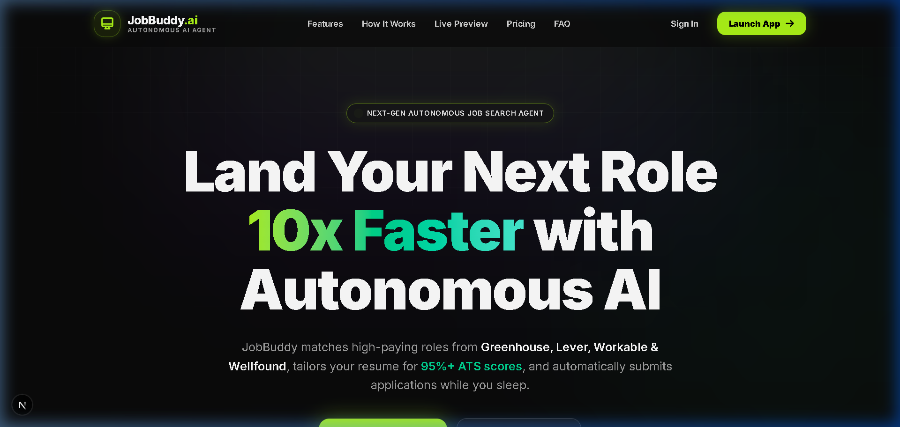
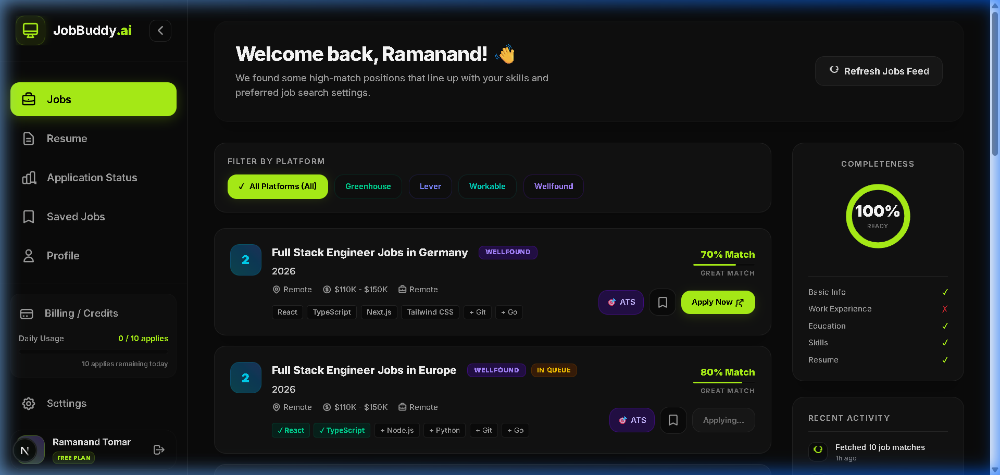
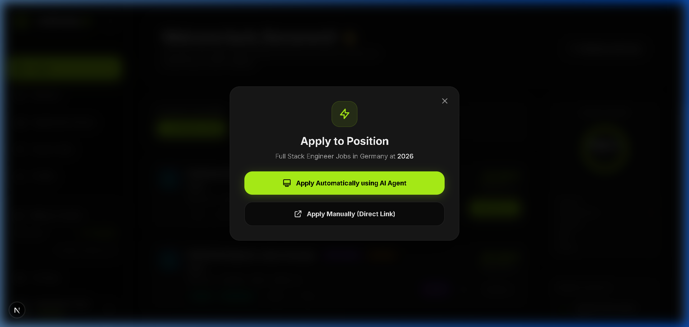
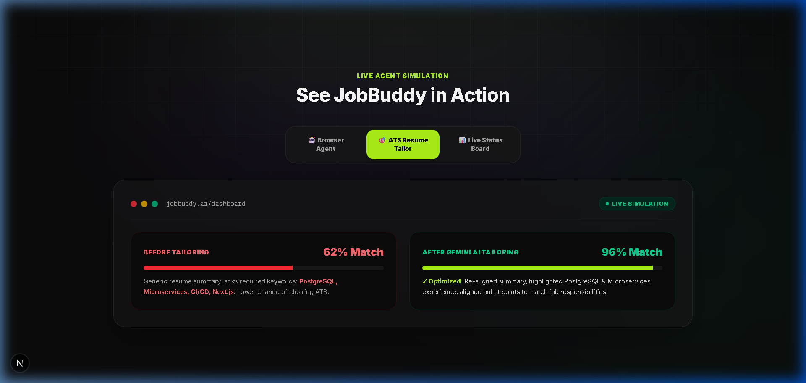
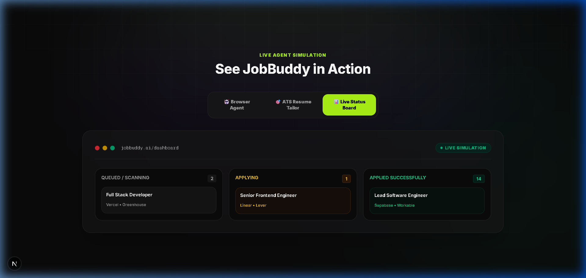
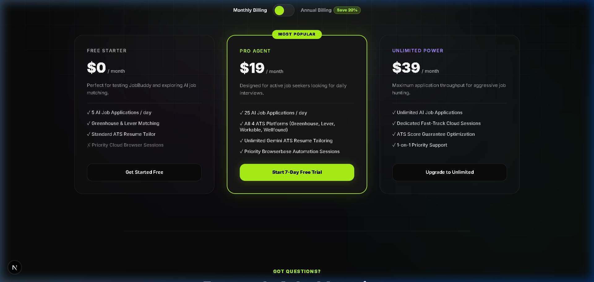
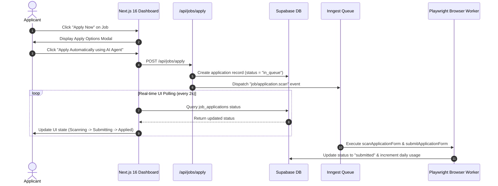

# JobBuddy.ai — Autonomous AI Job Application Agent

<div align="center">

  

  ### *Apply to 100s of Jobs Automatically while maintaining 95%+ ATS Compatibility*

  [](https://nextjs.org/)
  [](https://www.typescriptlang.org/)
  [](https://tailwindcss.com/)
  [](https://supabase.com/)
  [](https://ai.google.dev/)
  [](https://www.inngest.com/)
  [](LICENSE)

</div>

---

## 🌟 Overview

**JobBuddy.ai** is an autonomous AI-powered job application platform designed to eliminate the tedious manual grind of applying to engineering jobs. 

It aggregates real-time job listings from major Applicant Tracking Systems (**Greenhouse, Lever, Workable, & Wellfound**), parses job requirements, uses **Google Gemini AI** to rewrite and tailor candidate resumes for **95%+ ATS compatibility**, and executes automated Playwright browser submission sessions in the cloud.

---

## ✨ Key Features

- 🤖 **Autonomous Playwright Browser Agent**: Launches cloud Playwright sessions (via Browserbase) to navigate job application pages, detect input fields, auto-fill candidate profiles, and submit forms.
- 🎯 **Gemini ATS Resume Optimizer**: Analyzes target job descriptions and dynamically rewrites summaries, re-aligns skill tags, and optimizes experience bullet points for maximum ATS pass rates.
- 🔍 **Multi-Platform Job Matcher**: Fetches live jobs from Greenhouse, Lever, Workable, and Wellfound, scoring candidate match percentages in real-time.
- 📊 **Real-Time Kanban Application Tracker**: Monitor every application through live pipeline stages (`In Queue` → `Scanning Fields` → `Action Required` → `Submitting` → `Applied`).
- ⚡ **Instant Resume Parsing**: Upload your PDF resume to instantly extract work experience, skills, education, and contact info into a structured profile.
- 🛡️ **Missing Field AI Resolver**: If an ATS form requests specific questions missing from your profile, Gemini AI extracts the optimal response from your career history.

---

## 📸 Screenshots & Visual Walkthrough

### 🚀 Hero Landing Page


---

### 🔍 Live Job Matches & ATS Compatibility Scores


---

### 🤖 Automated AI Agent Application Dialog


---

### 🎯 Gemini ATS Resume Optimization


---

### 📊 Real-Time Application Kanban Tracker


---

### 💳 Pricing & Subscription Management


---

## 🏗️ System Architecture



---

## 🛠️ Tech Stack

- **Framework**: [Next.js 16 (App Router with Turbopack)](https://nextjs.org/)
- **Frontend**: [React 19](https://react.dev/), [TailwindCSS 4](https://tailwindcss.com/), [Shadcn UI](https://ui.shadcn.com/)
- **Database & Auth**: [Supabase](https://supabase.com/) (PostgreSQL, Row Level Security, Storage)
- **AI & LLM**: [Google Gemini 2.5 Flash (`@google/genai`)](https://ai.google.dev/)
- **Event Queue & Background Jobs**: [Inngest](https://www.inngest.com/) (`inngest/next`)
- **Browser Automation**: [Playwright Core](https://playwright.dev/) & [Browserbase CDP](https://www.browserbase.com/)

---

## 🚀 Getting Started

### Prerequisites

Ensure you have the following installed:
- **Node.js**: `v18+` or `v20+`
- **npm** or **pnpm**
- A **Supabase** project (URL + Anon Key + Service Role Key)
- A **Google Gemini API Key**
- *(Optional)* **Browserbase API Key & Project ID** for cloud browser sessions
- *(Optional)* **Tavily API Key** for enhanced live job scraping

---

### Environment Setup

Create a `.env` file in the root directory:

```env
NEXT_PUBLIC_SUPABASE_URL=https://your-supabase-project.supabase.co
NEXT_PUBLIC_SUPABASE_ANON_KEY=your-supabase-anon-key
SUPABASE_SERVICE_ROLE_KEY=your-supabase-service-role-key
GEMINI_API_KEY=your-gemini-api-key
TAVILY_API_KEY=your-tavily-api-key
BROWSERBASE_API_KEY=your-browserbase-api-key
BROWSERBASE_PROJECT_ID=your-browserbase-project-id
INNGEST_DEV=1
```

---

### Installation & Running Locally

1. **Clone the Repository**:
   ```bash
   git clone https://github.com/Ramanand-tomar/Jobs-and-intenrship-Automation.git
   cd Jobs-and-intenrship-Automation
   ```

2. **Install Dependencies**:
   ```bash
   npm install
   ```

3. **Run Next.js Development Server**:
   ```bash
   npm run dev
   ```
   Open [http://localhost:3000](http://localhost:3000) in your browser.

4. **Run Inngest Dev Server** (in a separate terminal window):
   ```bash
   npx inngest-cli dev -u http://localhost:3000/api/inngest
   ```
   Open the Inngest Dev Dashboard at [http://localhost:8288](http://localhost:8288).

---

## 📁 Repository Structure

```text
AI-job-agent/
├── docs/
│   └── images/                # Screenshots & visual assets
├── src/
│   ├── app/
│   │   ├── api/               # Next.js API Routes (apply, jobs, inngest, profile, auth)
│   │   ├── dashboard/         # Dashboard views (jobs, status, profile, resume, billing)
│   │   ├── login/             # Auth pages
│   │   ├── onboarding/        # Profile onboarding wizard
│   │   └── page.tsx           # Professional landing page
│   ├── components/            # Reusable UI components (ApplyDialog, ResumeTailor, etc.)
│   ├── lib/
│   │   ├── inngest/           # Inngest client & background event functions
│   │   ├── supabase/          # Supabase client & middleware helpers
│   │   └── gemini.ts          # Gemini AI prompt helpers
│   └── types/                 # TypeScript interfaces & database definitions
├── supabase/
│   └── migrations/            # SQL schemas, triggers & RLS policy migrations
├── package.json
└── README.md
```

---

## 🤝 Contributing

Contributions are always welcome! Feel free to open an issue or submit a pull request:

1. Fork the Project
2. Create your Feature Branch (`git checkout -b feature/AmazingFeature`)
3. Commit your Changes (`git commit -m 'Add some AmazingFeature'`)
4. Push to the Branch (`git push origin feature/AmazingFeature`)
5. Open a Pull Request

---

## 📄 License

Distributed under the MIT License. See `LICENSE` for more information.

---

<div align="center">

Made with ❤️ by [Ramanand Tomar](https://github.com/Ramanand-tomar)

</div>
